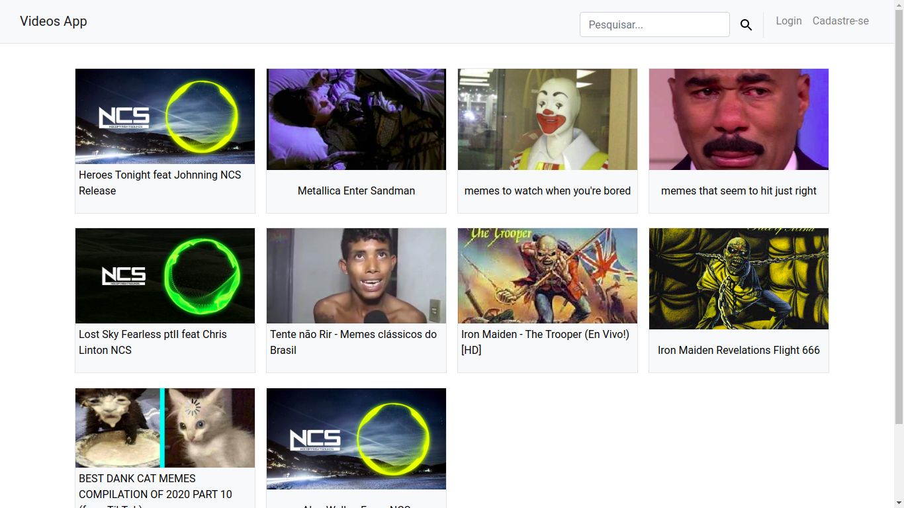
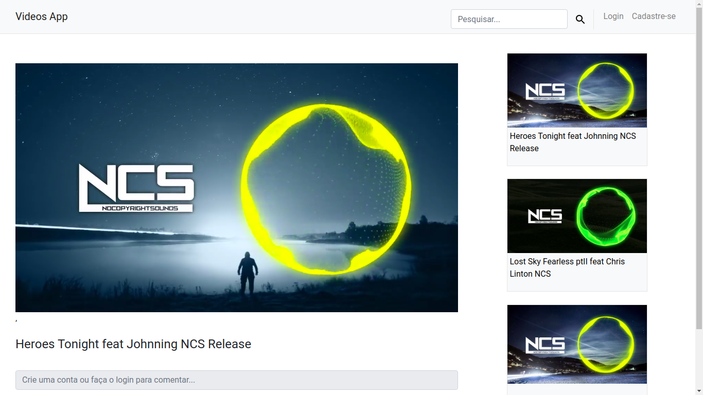
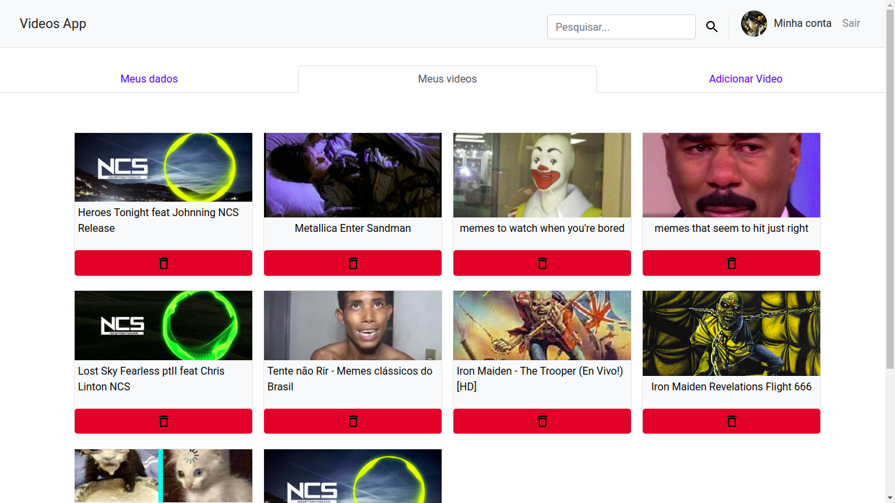

# videos-app-frontend

 
 

 
 

 
 

 
 

  Esta aplicação é feita com [Next.js](https://nextjs.org/), [Docker](https://www.docker.com/), [Helm](https://helm.sh/) e [Kubernetes](https://kubernetes.io/pt-br/), consome uma [API](https://github.com/hudsonfranca/videos-app-backend.git) feita com o [Nest.js](https://nestjs.com/).
  

